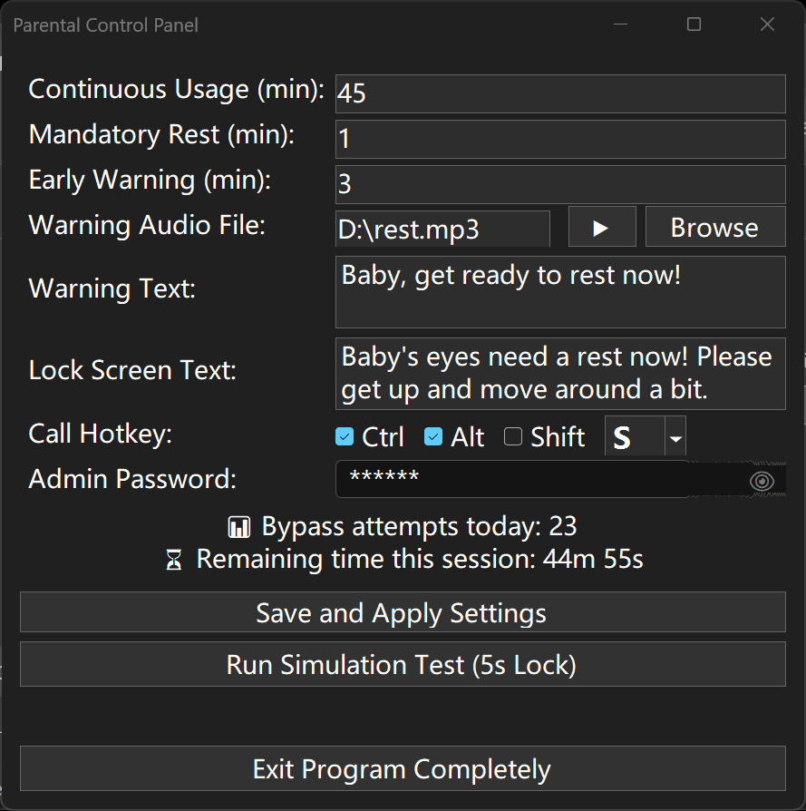

[English](README.md) | [简体中文](README.zh-CN.md)

---

# ChildGuard (儿童眼睛守护者) 🛡️👀

[](https://microsoft.com/windows)
[](https://docs.microsoft.com/en-us/dotnet/csharp/)
[]()

**ChildGuard** 是一款专为保护儿童视力开发的 Windows 桌面端家长控制软件。它通过在后台静默运行，监控电脑的连续使用时间，并在达到设定阈值时强制锁定屏幕，提醒孩子离开座位休息。  
  

## ✨ 核心特性

* **⏳ 智能强制休息**：全屏动画锁屏，屏蔽常规操作，确保眼睛得到充分休息。
* **⚠️ 提前预警机制**：在锁屏前提供倒计时悬浮窗（支持鼠标拖拽）和自定义音频提醒。
* **🔒 家长控制面板**：核心设置受家长密码保护，防止孩子自行修改规则或退出程序。
* **⌨️ 隐蔽后台与全局热键**：程序默认无后台托盘图标，纯静默运行，通过自定义全局快捷键呼出。
* **🌍 双语支持 (i18n)**：根据操作系统的语言设置，自动适配中文 (zh_CN) 或英文 (en_US)。
* **🎨 沉浸式暗黑 UI**：重绘了多种底层 Windows Forms 控件（圆角密码框、暗黑下拉菜单等），视觉体验更佳。

## 🚀 快速开始

### 1. 默认凭证 (重要！)
首次运行程序后，请使用以下默认凭证呼出控制面板并进行修改：
* **默认呼出快捷键**：`Ctrl + Alt + S`
* **默认家长密码**：`123456`

### 2. 环境要求
* 操作系统：Windows 7 / 10 / 11 
* 运行环境：自带的 .NET Framework 4.5 或更高版本（Windows 10/11 已内置）

### 3. 如何使用
1. 下载最新 Release 中的 `ChildGuard.exe` 可执行文件。
2. 双击运行，程序将自动进入后台静默守护模式。
3. 按下设定的快捷键（默认 `Ctrl+Alt+S`）唤出身份验证窗口。
4. 输入密码后进入控制面板进行自定义设置。

## 🛠️ 极简编译说明 (纯命令行)

本项目为纯粹的单文件 C# 源码，无需庞大的 IDE 即可直接使用 Windows 内置的编译器编译。

打开 CMD 命令行，执行以下命令即可生成无控制台黑框的桌面程序（假设你的系统盘在 C 盘）：
```cmd
C:\Windows\Microsoft.NET\Framework\v4.0.30319\csc.exe /target:winexe /out:ChildGuard.exe "ChildGuard.cs"
```

## 📜 版权与鸣谢

作者：大许律师 (Lawyer Xu)  
版权所有：Copyright © 2026  

用心守护孩子的健康成长。